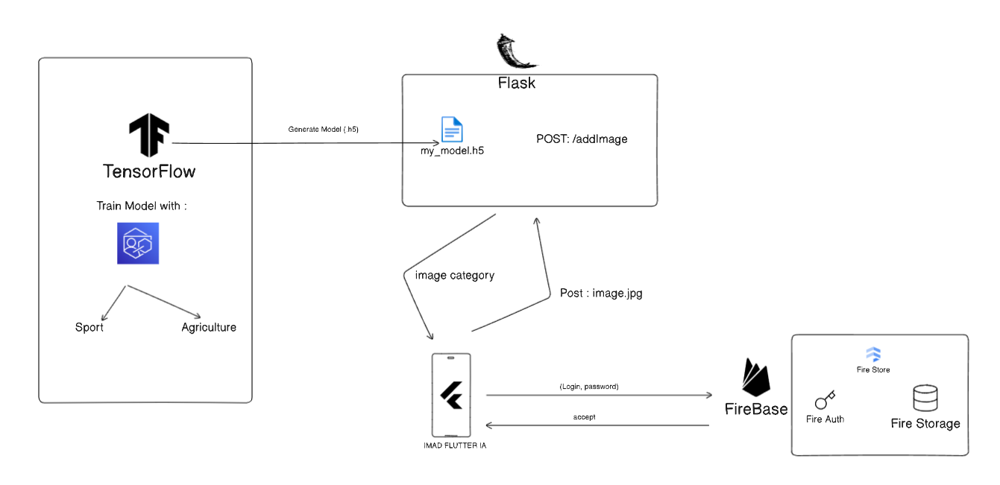
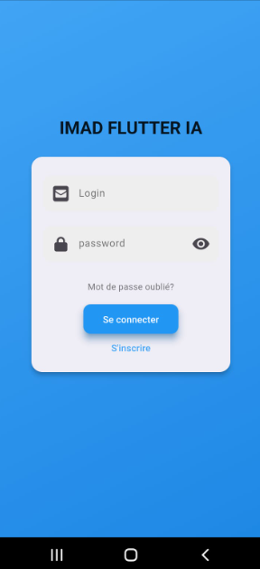
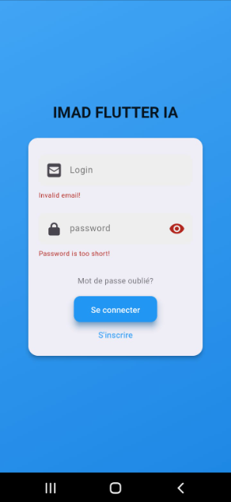
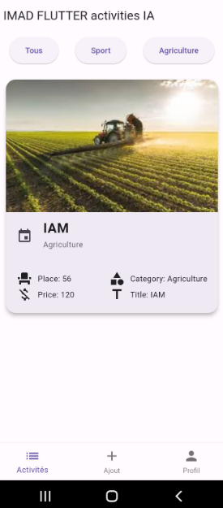
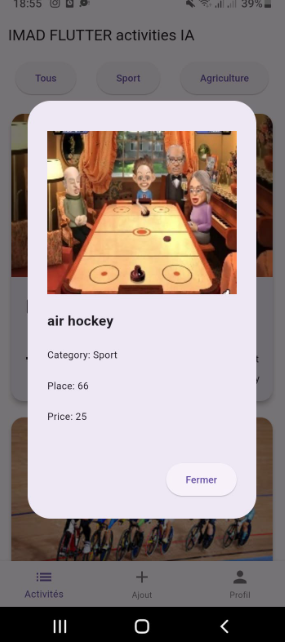
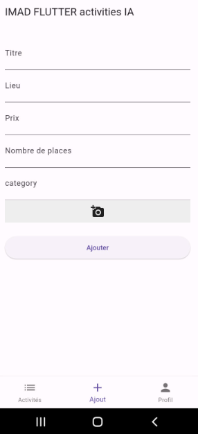

# FA.IMAD FLUTTER AI

## Description du Projet
Dans ce projet, j'ai créé une application mobile en utilisant Flutter. J'ai également utilisé TensorFlow pour entraîner un modèle de classification d'images. De plus, j'ai développé une API à l'aide de Flask permettant l'envoi d'images et le retour de la catégorie correspondante.

## Sommaire
1. [3.1. US#1 : [MVP] Interface de login](#31-us1--mvp-interface-de-login)
2. [3.2. US#2 : [MVP] Liste des activités](#32-us2--mvp-liste-des-activités)
3. [3.3. US#3 : [MVP] Détail d'une activité](#33-us3--mvp-détail-dune-activité)
4. [3.4. US#4 : [MVP] Filtrer sur la liste des activités](#34-us4--mvp-filtrer-sur-la-liste-des-activités)
5. [3.5. US#5 : [IA] Ajouter une nouvelle activité](#35-us5--ia-ajouter-une-nouvelle-activité)
6. [Comment utiliser cette application](#comment-utiliser-cette-application)

## 3.1. US#1 : [MVP] Interface de login

### Objectif
En tant qu'utilisateur, je souhaite pouvoir me connecter à l'application afin d'accéder à la page suivante.

### Login Page :
1. Au lancement de l'application, une interface de login est présentée, comprenant un headerBar avec le nom de l'application, deux champs (Login et Password), et un bouton "Se connecter".
2. Les champs de saisie sont nommés "Login" et "Password".
3. Le champ de saisie du mot de passe est obfusqué.
4. Le label du bouton de connexion est "Se connecter".
5. Au clic sur le bouton "Se connecter", une vérification en base est réalisée. Si l'utilisateur existe, il est redirigé vers la page suivante. Si l'utilisateur n'existe pas, un log est affiché dans la console, et l'application reste fonctionnelle.
6. Au clic sur le bouton "Se connecter" avec les deux champs vides, l'application reste fonctionnelle.

### Captures d'écran

.

## 3.2. US#2 : [MVP] Liste des activités

### Objectif
En tant qu'utilisateur connecté, je souhaite voir la liste des activités afin de choisir celles auxquelles je veux m'inscrire.

### Critères d'acceptance
1. Une fois connecté, l'utilisateur arrive sur la page Activités, composée du contenu principal et d'une BottomNavigationBar avec trois entrées et leurs icônes correspondantes : Activités, Ajout et Profil.
2. La page actuelle est la page Activités. Son icône et son texte sont d'une couleur différente des autres entrées.
3. Une liste déroulante de toutes les activités est proposée à l'écran.
4. Chaque activité affiche une image, un titre, un lieu et un prix.
5. Au clic sur une entrée de la liste, le détail est affiché (voir US#3).
6. La liste d'activités est récupérée de la base de données.

### Capture d'écran

## 3.3. US#3 : [MVP] Détail d'une activité

### Objectif
En tant qu'utilisateur connecté, je souhaite voir le détail d'une activité afin de pouvoir vérifier si elle me convient.

### Critères d'acceptance
1. La page de détail est composée des informations suivantes : une image, un titre, une catégorie (Sport, Shopping, Ludique, ...), le lieu, le nombre de personnes minimum pour réaliser l'activité, et le prix.

### Capture d'écran

## 3.4. US#4 : [MVP] Filtrer sur la liste des activités

### Objectif
En tant qu'utilisateur connecté, je souhaite pouvoir filtrer la liste des activités pour afficher seulement une catégorie.

### Critères d'acceptance
1. Sur la page « Activités », une TabBar (https://flutter.dev/docs/cookbook/design/tabs) est présente, listant les différentes catégories d’activités.
2. Par défaut, l’entrée « Tous » est sélectionnée et toutes les activités sont affichées.
3. Au clic sur une des entrées, la liste est filtrée pour afficher seulement les activités correspondantes à la catégorie sélectionnée.

### Capture d'écran

## 3.5. US#5 : [IA] Ajouter une nouvelle activité

### Objectif
En tant qu'utilisateur connecté, je souhaite pouvoir ajouter une nouvelle activité à partir de mon profil.

### Critères d'acceptance
1. Sur la BottomNavigationBar, j’accède à cette page au clic sur l’item « Ajout ».
2. Un formulaire s’affiche me permettant de saisir les informations suivantes :
   - Une image
   - Un titre
   - Une catégorie (Sport, Agriculture) : Ce champ est non éditable et doit être automatiquement défini à l’upload de l’image (IA).
   - Le lieu
   - Le nombre de personnes minimum nécessaire
   - Le prix
3. Un bouton « Valider » permet de sauvegarder les données (en base de données).

### Capture d'écran

## Comment utiliser cette application :
1) - Entraîner le modèle par des images Sport & Agriculture de votre choix.
2) - Appré sauvegarder le modèle sous forme "my_model.h5".
     (Note : le modèle existe dans le dossier : 'model-training')
3) - Déplacez le modèle 'my_model.h5' dans le dossier 'classfy_api'.
4) - Ouvrir 'classfy_api' et lancez l'API par la commande [python ./main.py].
5) - Mentionner l'adresse de votre API dans l'application mobile dans le fichier (lib\Dashboard\Pages\activites_screen.dart).
